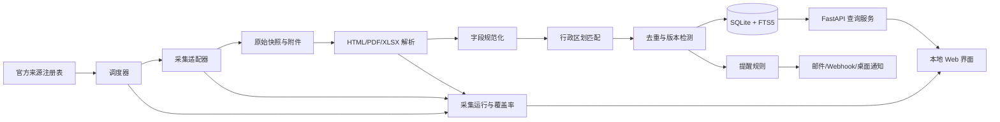

# 公职与国企招聘信息聚合系统架构

## 1. 项目边界

本系统面向个人使用，在 Mac mini M4 上本地运行，聚合以下公开招聘信息：

- 中央机关及其直属机构公务员招录；
- 各省公务员招录；
- 中央、省、市、县事业单位公开招聘；
- 央企及地方国企招聘，首期重点接入国家电网；
- 与招聘批次关联的报名、资格审查、准考证、笔试、面试、体检、公示和补录通知。

系统只保存公开岗位与公告信息，不自动登录、不代替用户报名、不绕过验证码或访问控制。

### 核心目标

1. 支持全国、省级、地级行政区筛选；
2. 对同一招聘批次的岗位和考试通知建立时间线；
3. 增量采集、内容去重、变更检测和截止日期提醒；
4. 能逐步增加省市网站，而不修改核心业务代码；
5. 显示来源、采集时间和原文链接，避免将解析结果误当成官方原文。

### 不追求的目标

- 不承诺首期覆盖全国所有县级网站；
- 不建设分布式爬虫、Elasticsearch、Kafka、Redis 或微服务；
- 不采集简历、身份证号、手机号等求职者个人信息；
- 不将聚合页面公开发布或商业化转载。

## 2. 总体架构



采用“模块化单体”而不是微服务。采集、解析、查询和提醒在一个 Python 项目内分模块运行，数据存储使用 SQLite；当单机数据量或并发确实成为瓶颈后，再替换为 PostgreSQL，而不提前引入运维负担。

## 3. 推荐技术栈

| 层 | 首选技术 | 说明 |
|---|---|---|
| 语言 | Python 3.12+ | 爬虫与文档解析生态完整 |
| HTTP 采集 | `httpx` | 支持异步、超时、重试和连接池 |
| HTML 解析 | `selectolax` 或 `lxml` | 比浏览器自动化稳定、资源占用低 |
| 动态页面后备 | Playwright | 仅用于必须执行 JavaScript 的公开页面 |
| 附件解析 | `openpyxl`、`pandas`、`pdfplumber`、OCR 后备 | 岗位表常位于 XLSX/PDF 中 |
| 数据校验 | Pydantic | 统一适配器输出协议 |
| API | FastAPI | 提供筛选、详情、订阅和运行状态接口 |
| 数据库 | SQLite + FTS5 | 个人本地使用足够，支持中文关键词的基础全文检索 |
| 数据迁移 | Alembic | 保证字段调整可追踪 |
| 调度 | APScheduler；生产常驻可配 macOS `launchd` | 无需 Redis/Celery |
| 前端 | Vue 3 + TypeScript + Vite | 构建信息密集、低干扰的本地工作台 |
| 测试 | pytest + 固定网页样本 | 防止网站改版后静默产生错误数据 |

> SQLite FTS5 的中文分词能力有限。首期可将单位名、岗位名、专业要求生成二元词条；确有复杂中文相关性排序需求时，再增加 Meilisearch，不建议直接上 Elasticsearch。

## 4. 数据源分层

### 第一层：权威结构化或集中入口

| 类型 | 首期来源 | 采集重点 |
|---|---|---|
| 国考 | 国家公务员局年度考录专题 | 招考公告、招考简章附件、补录、考试通知 |
| 中央事业单位 | 人社部中央和国家机关事业单位公开招聘服务平台 | 公告列表、正文、附件 |
| 综合公共招聘 | 中国公共招聘网 / 全国就业公共服务平台 | 事业单位及国有企业公开岗位 |
| 国家电网 | 国家电网有限公司人力资源招聘平台 | 单位公告、批次、需求岗位、截止日期 |

### 第二层：省级权威来源

- 省级党委组织部门公务员招录专题；
- 省级人力资源和社会保障厅、人事考试网；
- 省级国资委和地方国企官方招聘栏目；
- 国家电网各省电力公司在统一平台发布的公告。

### 第三层：地市与用人单位来源

- 地级市人社局、考试院、人才服务中心；
- 事业单位主管部门和招聘单位官网；
- 国企官网招聘栏目。

不能假设一个全国平台覆盖全部省市事业单位。系统必须维护 `source_registry` 和覆盖率页面，明确显示某省已接入哪些来源、最近成功采集时间及解析状态。

## 5. 核心领域模型

### 5.1 三层主体

```text
RecruitmentBatch（招聘批次）
├── Position（岗位，0..N）
├── ExamEvent（考试/流程事件，0..N）
├── Document（公告正文与附件，1..N）
└── Revision（内容版本，1..N）
```

- `RecruitmentBatch`：例如“某单位 2027 年度第一批公开招聘”。
- `Position`：岗位名称、岗位代码、人数、工作地点、学历、学位、专业、政治面貌、基层经历、应届要求等。
- `ExamEvent`：公告发布、报名开始/截止、缴费、准考证打印、笔试、成绩、资格复审、面试、体检、公示、补录。
- `Document`：原网页、PDF、XLSX、DOCX 等证据文件。
- `Revision`：公告内容更新或附件替换后的历史版本。

### 5.2 主要数据表

```text
source_registry
  id, name, category, base_url, authority_level,
  province_code, city_code, adapter_key, crawl_policy,
  interval_minutes, enabled, last_success_at, health_status

crawl_run
  id, source_id, started_at, finished_at, status,
  fetched_count, parsed_count, new_count, changed_count,
  error_type, error_message

raw_document
  id, source_id, source_url, canonical_url, fetched_at,
  http_status, content_type, content_hash, storage_path,
  parser_version, parse_status

organization
  id, canonical_name, aliases, organization_type,
  parent_id, province_code, city_code, official_url

recruitment_batch
  id, organization_id, source_id, title, recruitment_type,
  audience_type, year, batch_no, publish_at,
  application_start_at, application_end_at, status,
  source_url, first_seen_at, last_seen_at, content_hash

position
  id, batch_id, source_position_id, position_code, title,
  department, headcount, education, degree, majors_raw,
  political_status, work_experience, graduate_year,
  age_requirement, household_requirement, other_requirements

position_location
  position_id, division_id, location_type, precision,
  raw_text, confidence

exam_event
  id, batch_id, event_type, title, start_at, end_at,
  province_code, city_code, source_url, status

document_attachment
  id, raw_document_id, batch_id, file_name, file_type,
  download_url, local_path, sha256, extraction_status

subscription
  id, name, enabled, query_json, notify_channel,
  advance_hours, last_notified_at

notification_log
  id, subscription_id, entity_type, entity_id,
  reason, payload_hash, sent_at, status
```

### 5.3 招聘类别枚举

```text
CIVIL_SERVICE_NATIONAL   国考
CIVIL_SERVICE_PROVINCE   省考
PUBLIC_INSTITUTION       事业单位
SOE_STATE_GRID           国家电网
SOE_CENTRAL              其他央企
SOE_LOCAL                地方国企
```

不要仅凭标题中的“国企”自动认定企业性质。企业类别应来自国资委名录、企业官方信息或人工确认；无法核实的记录标为 `UNKNOWN`。

## 6. 行政区划与筛选语义

行政区划以现行 GB/T 2260 六位代码为标准编码。考虑撤县设市、地名变更等历史变化，数据库使用内部 `division_id` 作为主键，不把可能调整的区划代码当作永久主键：

```text
administrative_division
  division_id, code, name, level, parent_id,
  valid_from, valid_to, aliases
```

地点必须区分：

- `WORK_LOCATION`：实际工作地点；
- `ORG_LOCATION`：招聘单位所在地；
- `EXAM_LOCATION`：笔试或面试地点；
- `APPLICATION_SCOPE`：户籍、生源地或服务范围限制。

`precision` 取值：`NATIONWIDE`、`PROVINCE`、`CITY`、`COUNTY`、`MULTI_REGION`、`UNKNOWN`。不得把单位所在地直接当成工作地点。

### 筛选规则

- 选择“全国”：不增加行政区条件；
- 选择省份：匹配该省下所有工作地点；可切换“包含全国性/地点待分配岗位”；
- 选择地级市：精确匹配该市及所辖县区；可切换“包含仅标到省级的岗位”；
- 多地岗位：通过 `position_location` 多对多关系命中任一地点；
- “工作地点待分配”和“服从调剂”单独展示，不能错误归入单位注册地。

建议查询参数：

```text
GET /api/positions?
  province_code=370000&
  city_code=370900&
  categories=PUBLIC_INSTITUTION,SOE_STATE_GRID&
  keyword=计算机&
  education=BACHELOR&
  status=OPEN&
  include_broader_scope=true&
  page=1&page_size=20
```

## 7. 采集适配器协议

每个来源只实现差异化逻辑，输出统一对象：

```python
class SourceAdapter(Protocol):
    async def discover(self, cursor: str | None) -> list[DiscoveredItem]: ...
    async def fetch(self, item: DiscoveredItem) -> RawDocument: ...
    async def parse(self, document: RawDocument) -> ParsedRecruitment: ...
```

适配器分四类：

1. `ListDetailAdapter`：公告列表页 → 详情页；
2. `PublicApiAdapter`：公开且允许访问的 JSON 接口；
3. `AttachmentAdapter`：详情页 → PDF/XLSX 岗位表；
4. `BrowserAdapter`：只有公开动态页面无法用普通 HTTP 获取时启用。

每个适配器都应有：

- 固定 HTML/JSON/PDF/XLSX 样本；
- 字段完整率断言；
- 页面结构指纹；
- 解析版本号；
- 失败阈值和自动停用机制。

不要把 CSS 选择器、请求参数和业务清洗规则堆在同一个函数中。

## 8. 采集流水线

### 8.1 执行顺序

```text
读取来源策略
→ 检查 robots.txt、使用条款和频率限制
→ 列表增量发现
→ 条件请求（ETag/Last-Modified）
→ 保存原始响应
→ 提取正文和附件
→ 映射统一字段
→ 行政区划识别
→ 质量校验
→ 去重与版本判断
→ 写入业务表
→ 触发订阅匹配
→ 记录覆盖率和失败原因
```

### 8.2 调度建议

| 来源状态 | 建议频率 |
|---|---:|
| 报名开放且临近截止 | 30～60 分钟 |
| 正常招聘季 | 2～4 小时 |
| 非招聘季或历史栏目 | 12～24 小时 |
| 连续失败 | 指数退避，达到阈值后暂停并提醒 |

同一域名建议单并发或至多 2 并发，请求间隔加入随机抖动。服务器返回 `429`、`403` 或验证码时应停止并记录，不应自动对抗限制。

### 8.3 增量策略

- 列表游标：最后公告时间、来源 ID 或页码；
- HTTP 游标：`ETag`、`Last-Modified`；
- 内容游标：正文标准化后的 SHA-256；
- 附件游标：附件字节 SHA-256；
- 时间回看：每次额外回扫最近 7～14 天，捕捉原公告修改。

## 9. 去重、变更和可信度

### 去重分级

1. **强标识去重**：来源 ID、规范化 URL、附件哈希；
2. **业务键去重**：单位规范名 + 年份 + 批次 + 岗位代码；
3. **跨来源候选去重**：标题相似度 + 单位 + 发布日期 + 地点；
4. **人工确认**：模糊匹配只生成候选关系，不自动删除记录。

官方原始来源作为主记录，转载来源只作为补充证据。同一公告更新时创建 `Revision`，保留旧版本，并显示字段差异，例如报名截止日期改变、岗位人数改变或附件被替换。

### 字段可信度

每个解析字段可记录：

```text
value, raw_text, extractor, confidence, source_document_id
```

规则解析得到的明确日期和代码可设高置信度；由标题、单位地址推断的地点只能设低置信度。低置信度字段在界面中显示“待核对”，提醒以原文为准。

## 10. 状态机与提醒

### 招聘状态

```text
UPCOMING → OPEN → CLOSED → EXAM → INTERVIEW → RESULT → FINISHED
                  ↘ CANCELLED
```

状态优先由官方事件驱动；只有报名截止时间明确时，才由系统自动从 `OPEN` 切到 `CLOSED`。

### 订阅示例

```json
{
  "locations": ["370000", "370900"],
  "categories": ["PUBLIC_INSTITUTION", "SOE_STATE_GRID"],
  "keywords_any": ["计算机", "软件", "信息化"],
  "education_max": "BACHELOR",
  "exclude_keywords": ["博士", "劳务派遣"],
  "notify_on": ["NEW_POSITION", "DEADLINE_72H", "CONTENT_CHANGED"]
}
```

提醒必须以 `subscription_id + entity_id + reason + payload_hash` 保证幂等，避免每轮采集重复通知。

## 11. API 与界面

### 后端接口

- `GET /api/divisions`：省市级联数据；
- `GET /api/positions`：岗位组合筛选；
- `GET /api/batches/{id}`：批次、岗位、附件、事件时间线；
- `GET /api/events/calendar`：报名和考试日历；
- `POST /api/subscriptions`：保存个人筛选与提醒；
- `GET /api/sources/coverage`：各地区来源覆盖和健康状态；
- `GET /api/crawl-runs`：最近采集结果；
- `POST /api/admin/sources/{id}/run`：手动采集单个来源。

### 本地工作台

1. **岗位页**：类别、省、市、学历、专业、应届/社招、报名状态、关键词；
2. **详情页**：结构化条件、原文链接、附件、来源、解析置信度、变更记录；
3. **日历页**：报名截止、缴费、准考证、笔试、面试；
4. **订阅页**：保存查询和通知渠道；
5. **覆盖页**：各省来源数量、最后成功时间、连续失败次数、数据新鲜度。

## 12. 项目目录

```text
exam-finding/
├── app/
│   ├── api/                 # FastAPI 路由
│   ├── core/                # 配置、日志、时间和重试策略
│   ├── domain/              # 领域模型与枚举
│   ├── db/                  # ORM、迁移、仓储
│   ├── crawlers/
│   │   ├── base.py          # 适配器协议
│   │   ├── registry.py      # 来源注册
│   │   ├── national_exam/
│   │   ├── mohrss/
│   │   └── state_grid/
│   ├── parsers/             # HTML、PDF、XLSX、DOCX
│   ├── normalization/       # 单位、地点、学历、日期规范化
│   ├── dedup/               # 去重与版本检测
│   ├── scheduler/           # 任务调度
│   └── notifications/       # 邮件、Webhook、桌面提醒
├── web/                     # Vue 前端
├── data/
│   ├── raw/                 # 原始页面和附件
│   ├── fixtures/            # 脱敏固定测试样本
│   └── exam_finding.db
├── config/
│   ├── sources.yaml
│   └── divisions.csv
├── tests/
│   ├── contract/            # 适配器契约测试
│   ├── fixtures/
│   └── integration/
├── scripts/
├── pyproject.toml
└── README.md
```

## 13. 质量与可观测性

每次采集至少记录：

- 成功率、响应时间、HTTP 状态分布；
- 新增、更新、重复、解析失败数量；
- 关键字段完整率：标题、单位、发布日期、原文链接、地点、截止时间；
- 页面结构变化；
- 每个地区和来源的数据新鲜度。

关键告警：

- 连续 3 次采集失败；
- 列表有数据但解析结果突然为 0；
- 关键字段完整率较最近基线显著下降；
- 同一来源新增量异常放大；
- 报名开放记录没有原文链接或截止时间解析冲突。

## 14. 合规与安全边界

1. 优先使用公开页面、公开下载文件和官方允许的接口；
2. 检查网站使用条款及 `robots.txt`，来源策略中保存核查结果；
3. 不绕过验证码、登录、签名、访问控制、频率限制或反自动化措施；
4. 不采集报名账号、简历、考生名单中的身份证号、手机号等个人信息；
5. 对公示名单只保存公告元数据和原文链接，默认不抽取自然人名单；
6. 限速、条件请求、缓存和指数退避，避免影响官方服务；
7. 本地密钥放入系统钥匙串或 `.env`，不得提交版本库；
8. 聚合内容仅供检索和提醒，报名资格与时间以官方原文为准。

## 15. 分阶段落地

### M0：工程骨架与数据标准（2～3 天）

- 建立数据表、行政区划、适配器协议和来源注册表；
- 实现原始快照、运行日志、去重和契约测试；
- 完成岗位查询 API 的最小闭环。

**验收**：手工导入样本后，可以按全国、省、地级市筛选，且多地岗位不重复。

### M1：三个高价值来源（5～8 天）

- 国考年度专题及 XLSX 招考简章；
- 人社部中央事业单位公开招聘平台；
- 国家电网招聘平台；
- 本地岗位列表、详情页和截止提醒。

**验收**：每条记录可追溯至原文；重复运行不会重复入库；公告修改能生成版本差异。

### M2：省级覆盖（按目标省逐个接入）

- 先接入本人关注的 3～5 个省；
- 建立省级组织部、人社厅、人事考试网来源组合；
- 增加来源覆盖率和解析健康页面。

**验收**：目标省每个已登记来源都有最近成功时间和失败原因，不用“零结果”伪装采集成功。

### M3：地市与更多央企

- 按个人求职范围增加地市人社局；
- 增加国资委央企名录驱动的企业来源注册；
- 仅在实际查询性能不足时升级数据库或搜索组件。

## 16. 关键决策

| 决策 | 选择 | 原因 |
|---|---|---|
| 架构形态 | 模块化单体 | 个人使用，部署和调试成本最低 |
| 数据库 | SQLite + FTS5 | 单用户、百万级以内岗位数据足够 |
| 地点模型 | 岗位—行政区多对多 | 支持全国、多省、多市和待分配地点 |
| 内容模型 | 批次—岗位—事件 | 同时覆盖招聘和考试全流程 |
| 采集策略 | HTTP 优先，浏览器后备 | 稳定、节约资源、减少对站点影响 |
| 数据真实性 | 原始快照 + 字段证据 + 版本 | 可复核且能发现官方更新 |
| 全国覆盖 | 来源注册表逐步扩展 | 国内事业单位发布渠道分散，不存在单一完备入口 |

## 17. 已核验的官方依据与入口

- [中央机关及其直属机构 2026 年度考试录用公务员专题](http://bm.scs.gov.cn/kl2026)
- [国家电网有限公司招聘平台](https://zhaopin.sgcc.com.cn/sgcchr/static/home.html)
- [国务院国资委发布的国家电网招聘公告](https://www.sasac.gov.cn/n2588035/n2588325/n2588350/c32874117/content.html)：明确招聘平台是国家电网及下属单位发布高校毕业生招聘信息的唯一官方网站。
- [中央和国家机关事业单位公开招聘服务平台](https://www.mohrss.gov.cn/SYrlzyhshbzb/fwyd/SYkaoshizhaopin/zyhgjjgsydwgkzp/)
- [中国公共招聘网事业单位公开招聘](https://job.mohrss.gov.cn/cjobs/institution/listInstitution)
- [全国就业公共服务平台](https://www.12333.gov.cn/job/?channel=12333)
- [GB/T 2260-2007《中华人民共和国行政区划代码》](https://openstd.samr.gov.cn/bzgk/std/newGbInfo?hcno=C9C488FD717AFDCD52157F41C3302C6D)：截至核验时仍为现行标准。
- [《网络数据安全管理条例》](https://xzfg.moj.gov.cn/front/law/detail?LawID=1734)
- [《中华人民共和国个人信息保护法》](https://www.cac.gov.cn/2021-08/20/c_1631050028355286.htm)
- [《中华人民共和国反不正当竞争法》（2025 年修订）](https://www.npc.gov.cn/npc/c2/c30834/202506/t20250627_446247.html)
